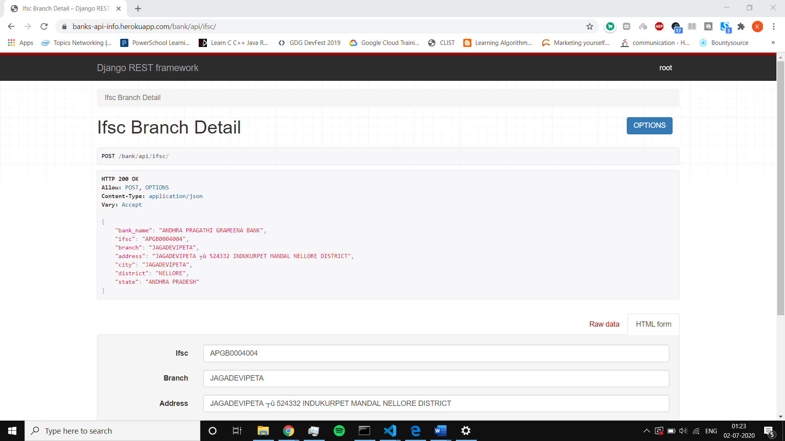
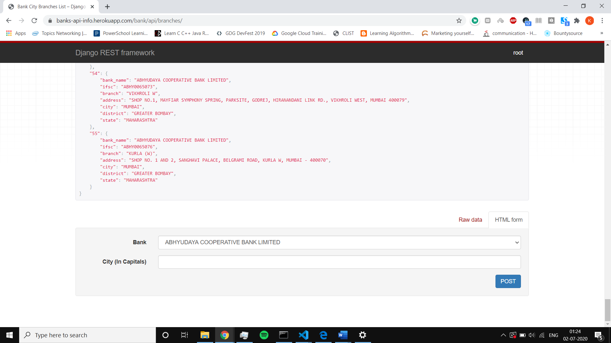

# Bank-Branches-Info-API
Retrieve full info of branches of Indian banks using IFSC code or City Params deployed at https://banks-api-info.herokuapp.com/bank/api/

 
<strong>*NOTE* - There is a limit of 10k db rows on free Heroku plan, so there are a lot of rows missing from the database. So, some queries may fail because of it 
on deployed version. So, please refer the first 10k entries of bank_branches.csv file to retrieve info and test this API. </strong> 
 
## Development Environment - 
* Django - 3.0.7
* Python - 3.8.2
* Database - Postgresql

## Rest Service APIs 

### A. Given a bank branch IFSC code, get branch details <a href="https://banks-api-info.herokuapp.com/bank/api/ifsc/">here</a>
* <strong>API Endpoint - https://banks-api-info.herokuapp.com/bank/api/ifsc/ - POST Request</strong>
* <strong>Request Paramters</strong>
  <table>
      <thead>
      <th>Fields</th>
      <th>Type</th>
      <th>Desc</th>
      </thead>
      <tr>
      <td>ifsc</td>
      <td>str</td>
      <td>required</td>
      </tr>
   </table>
* <strong>Response</strong>
   <table>
      <thead>
      <th>Fields</th>
      <th>Type</th>
      </thead>
      <tr>
      <td>bank_name</td>
      <td>str</td>
      </tr>
      <tr>
      <td>ifsc</td>
      <td>str</td>
      </tr>
      <tr>
      <td>branch</td>
      <td>str</td>
      </tr>
      <tr>
      <td>address</td>
      <td>str</td>
      </tr>
      <tr>
      <td>city</td>
      <td>str</td>
      </tr>
      <tr>
      <td>district</td>
      <td>str</td>
      </tr>
      <tr>
      <td>state</td>
      <td>str</td>
      </tr>
   </table>
* <strong>Sample Request Screenshot from browser</strong> 
  
  
### B. Given a bank name and city, gets details of all branches of the bank in the city <a href="https://banks-api-info.herokuapp.com/bank/api/branches/">here</a>
* <strong>API Endpoint - https://banks-api-info.herokuapp.com/bank/api/branches/ - POST Request</strong>
* <strong>Request Paramters</strong>
  <table>
      <thead>
      <th>Fields</th>
      <th>Type</th>
      <th>Desc</th>
      </thead>
      <tr>
      <td>bank</td>
      <td>object</td>
      <td>required</td>
      </tr>
      <tr>
      <td>city_name</td>
      <td>str</td>
      <td>required</td>
      </tr>
   </table>
* <strong>Response</strong>
   <table>
      <thead>
      <th>Fields</th>
      <th>Type</th>
      <th>Desc</th>
      </thead>
      <tr>
      <td>id</td>
      <td>int</td>
      <td>ith result of query</td>
      </tr>
      <tr>
      <td>bank_name</td>
      <td>str</td>
      <td>-</td>
      </tr>
      <tr>
      <td>ifsc</td>
      <td>str</td>
      <td>-</td>
      </tr>
      <tr>
      <td>branch</td>
      <td>str</td>
      <td>-</td>
      </tr>
      <tr>
      <td>address</td>
      <td>str</td>
      <td>-</td>
      </tr>
      <tr>
      <td>city</td>
      <td>str</td>
      <td>-</td>
      </tr>
      <tr>
      <td>district</td>
      <td>str</td>
      <td>-</td>
      </tr>
      <tr>
      <td>state</td>
      <td>str</td>
      <td>-</td>
      </tr>
   </table>
* <strong>Sample Request Screenshot from browser</strong> 
  

## Sample Credentials 
* To https://banks-api-info.herokuapp.com/bank/api/admin/
  <table>
    <thead>
    <th>USERNAME</th>
    <th>PASSWORD</th>
    </thead>
    <tr>
    <td>hello</td>
    <td>heyz@123</td>
    </tr>
 </table>

## Getting Started in Local Machine 
* Clone this repository.
* Set up a python virtual environment and activate it in your terminal. (Refer - <a>https://docs.python.org/3/tutorial/venv.html</a>)
* Open the repo in terminal and run the following commands - 
    ~~~ 
        pip install -r requirements.txt
    ~~~
    ~~~ 
        python manage.py makemigrations
    ~~~ 
    ~~~ 
        python manage.py migrate
    ~~~
    ~~~ 
        python manage.py runsever
    ~~~
* Test above API endpoints on http://127.0.0.1:8000/bank/api/ 

## Reference Links
* https://www.django-rest-framework.org/
* https://docs.djangoproject.com/en/3.0/
* https://github.com/snarayanank2/indian_banks

